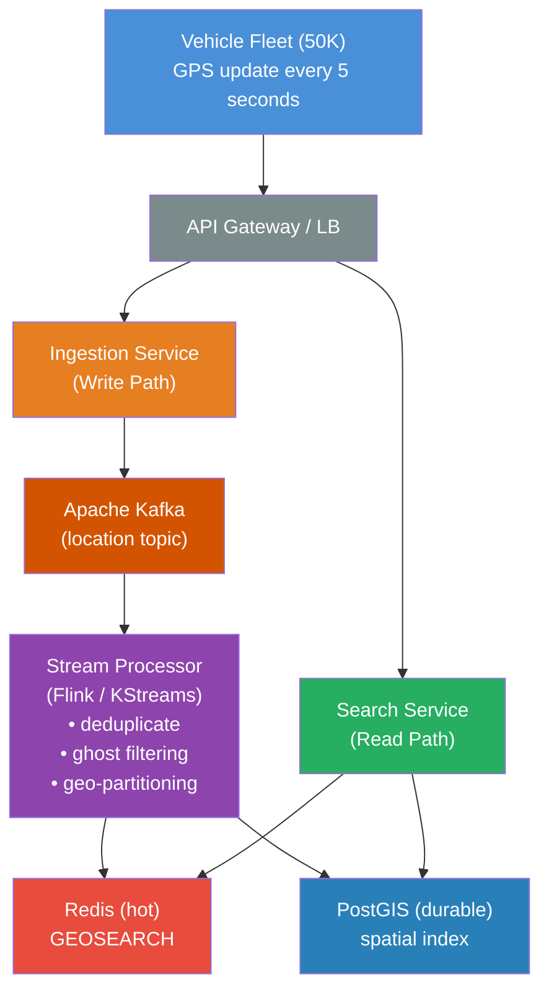

# Nearby Birds — Map Service

A backend service that powers the "nearby vehicles" map experience. Given a rider's location, it returns available Bird vehicles within a search radius, backed by PostGIS for geospatial queries.

---

## Part 1: System Architecture

### Overview

The system ingests real-time location updates from 50,000 vehicles across 100 cities (10,000 updates/sec at 5-second intervals) and serves 5,000 read requests/sec from riders opening the app. The architecture separates the **write path** (vehicle telemetry ingestion) from the **read path** (rider-facing search API) to allow each to scale independently.



### Write Path: Vehicle Location Ingestion

**Protocol:** Vehicles push location updates over a persistent connection (MQTT or gRPC streaming) to the Ingestion Service. This is more efficient than HTTP polling for high-frequency telemetry and allows the server to detect disconnections immediately.

**Buffering with Kafka:** The Ingestion Service publishes each update to a Kafka topic partitioned by `city_id`. Kafka decouples ingestion from processing, absorbs traffic spikes, and provides durability if downstream consumers fall behind. At 10K messages/sec with ~200-byte payloads, this is well within Kafka's throughput capacity on a modest cluster.

**Stream Processing:** A Flink (or Kafka Streams) job consumes from the topic and:

1. **Deduplicates** — drops stale/out-of-order updates using the vehicle's sequence number.
2. **Enriches** — joins with vehicle state (battery level, maintenance status) from a state store.
3. **Filters ghosts** — applies availability rules (see Ghost Problem section below).
4. **Writes to stores** — updates both Redis (for sub-millisecond reads) and PostGIS (for durability and analytics).

### Read Path: Nearby Vehicle Search

**Flow:** The rider's app sends `(lat, lng, radius)` to the Search Service behind a load balancer.

**Primary store — Redis with geospatial commands:** Each city's vehicles live in a Redis sorted set keyed by `city:<city_id>:vehicles`. The `GEOSEARCH` command returns members within a given radius from a point in O(N+log(M)) time (N = results, M = total members). For a city with ~500 vehicles and a typical 500m–1km search radius returning 10–30 results, this completes in under 1ms.

**Fallback — PostGIS:** If Redis is unavailable, the Search Service falls back to querying PostGIS using `ST_DWithin` on a GIST-indexed `geography` column. PostGIS queries for this workload complete in 5–20ms, which is acceptable as a degraded-mode path.

**Why two stores?** Redis gives us the latency profile we need for the 5,000 RPS read path. PostGIS gives us durability, rich querying for analytics/back-office, and a safety net. The stream processor keeps both in sync, and the Search Service health check distinguishes liveness from readiness based on store availability.

### Scaling Considerations

**Geo-sharding:** Both the Kafka topic partitioning and the Redis keyspace are segmented by city. This means we can independently scale hot cities (e.g., Los Angeles) by assigning them to dedicated Redis instances or Kafka partitions without affecting others.

**Read replicas:** Redis supports read replicas. For the busiest cities, we can fan out reads across replicas. PostGIS similarly supports streaming replication.

**Horizontal scaling of the Search Service:** The service itself is stateless — it reads from Redis/PostGIS. We can auto-scale pods behind the load balancer based on CPU or request latency.

**CDN / Edge caching is not appropriate here** because the data changes every few seconds and is location-specific. We rely on fast backends rather than caching.

### The "Ghost" Problem

A "ghost" vehicle appears on the map but isn't actually available when the rider arrives. This destroys user trust. The system tracks and evaluates multiple signals to filter them out:

| Signal | How it helps |
|---|---|
| **Last heartbeat age** | If a vehicle hasn't reported in > 30 seconds (6 missed heartbeats at 5s interval), it's likely offline. Mark stale and exclude from results. |
| **Battery level** | Vehicles below a rideable threshold (e.g., < 5%) should not appear as available even if they're reporting location. |
| **Active ride flag** | If the vehicle is currently in a ride session, exclude it from the nearby search. |
| **Maintenance / disabled flag** | Vehicles flagged for maintenance, reported damaged, or administratively disabled are excluded. |
| **GPS accuracy / confidence** | Low-accuracy GPS fixes (high HDOP or reported accuracy > 50m) indicate unreliable position. Either exclude or widen the uncertainty radius shown to the rider. |
| **Geofence violations** | A vehicle reporting from inside a body of water, on a highway, or outside its operational zone is likely a GPS glitch. Exclude it. |
| **Historical pickup failure rate** | If riders frequently report "can't find vehicle" at a location, that spot may have GPS shadow (parking garages, dense buildings). Down-rank vehicles there. |

**Implementation:** The stream processor evaluates these rules on every location update and sets an `available` boolean and a `confidence_score` (0.0–1.0) on each vehicle record. The Search Service only returns vehicles where `available = true` and optionally sorts by confidence. This keeps the read path simple — all the filtering logic lives in the write path.

### Observability Strategy

**Metrics (Micrometer → Prometheus → Grafana):**
- `search.requests` — counter, tagged by city and status code.
- `search.latency` — histogram of end-to-end response times.
- `vehicles.active` — gauge per city of vehicles passing the availability filter.
- `vehicles.ghost_filtered` — counter of vehicles excluded by ghost filtering, tagged by reason.

**Structured logging (JSON via Logstash encoder):**
- Every request logs: `request_id`, `city`, `lat/lng`, `radius`, `result_count`, `duration_ms`.
- Errors include full context for triage without needing to reproduce.

**Alerting:**
- P99 latency > 100ms → page.
- Ghost filter rate > 30% in a city → warning (may indicate a fleet-wide issue).
- Redis connection failures → readiness probe fails, traffic shifts.

---

## Part 2: API Implementation

This repository implements the **Read Path Search Service** as described above, using:

- **Kotlin + Spring Boot 3** — JVM-based, production-grade framework.
- **PostGIS (PostgreSQL + spatial extensions)** — geospatial queries via `ST_DWithin` and GIST indexes.
- **Flyway** — schema migrations.
- **Spring Actuator** — liveness (`/actuator/health/liveness`) and readiness (`/actuator/health/readiness`) probes.
- **Micrometer + Prometheus** — request latency histograms, counters, and custom metrics.
- **Structured JSON logging** — via Logstash Logback encoder.
- **Testcontainers** — integration tests against a real PostGIS instance.

### Prerequisites

- **Java 25+**
- **Docker & Docker Compose** (for running PostgreSQL/PostGIS)
- **Make** (for shortcuts; run `make help` to list targets)

### Quick Start

```bash
# One-time: create secrets/postgres_password (see instructions)
make secrets-help

# 1. Start PostGIS in Docker
make dev-db

# 2. Run the API on your machine (Gradle)
make run

# 3. App listens on http://localhost:8080 and seeds sample data on startup.
```

Or run **both** API and database in Docker (builds the app image; use when you don’t want Gradle on the host):

```bash
make up-build
```

Use `make help` for other Compose, Docker, and Gradle targets.

### API Endpoints

#### Search Nearby Vehicles

```
GET /api/v1/vehicles/nearby?lat={latitude}&lng={longitude}&radius={meters}&limit={max_results}
```

**Parameters:**
| Parameter | Type | Required | Default | Description |
|-----------|------|----------|---------|-------------|
| `lat` | double | yes | — | Latitude (-90 to 90) |
| `lng` | double | yes | — | Longitude (-180 to 180) |
| `radius` | double | no | 500 | Search radius in meters (1–5000) |
| `limit` | int | no | 20 | Max results (1–100) |

**Response (200 OK):**
```json
{
  "vehicles": [
    {
      "birdId": "BIRD-00042",
      "latitude": 34.0522,
      "longitude": -118.2437,
      "distanceMeters": 142.7
    }
  ],
  "count": 1,
  "searchCenter": {
    "latitude": 34.0525,
    "longitude": -118.2430
  },
  "searchRadiusMeters": 500.0
}
```

#### Health Checks

```
GET /actuator/health/liveness    → 200 if process is alive
GET /actuator/health/readiness   → 200 if database is reachable
GET /actuator/health             → combined health status
```

#### Metrics

```
GET /actuator/prometheus          → Prometheus-format metrics
```

Key metrics exposed:
- `nearby_search_requests_total` — counter by status
- `nearby_search_latency_seconds` — histogram
- `nearby_search_results_count` — distribution summary of result set sizes

#### Example `curl` commands

With the API listening on **port 8080** (default), you can exercise it from a shell. Responses use **camelCase** JSON keys (`birdId`, `distanceMeters`, `searchCenter`, etc.).

**Nearby search** — default radius 500 m, up to 20 results (seeded data is centered around Santa Monica and San Francisco):

```bash
curl -sS 'http://127.0.0.1:8080/api/v1/vehicles/nearby?lat=34.0195&lng=-118.4912'
```

**Nearby search** — custom radius (meters) and result limit:

```bash
curl -sS 'http://127.0.0.1:8080/api/v1/vehicles/nearby?lat=34.0195&lng=-118.4912&radius=1000&limit=50'
```

**Nearby search** — San Francisco seed region:

```bash
curl -sS 'http://127.0.0.1:8080/api/v1/vehicles/nearby?lat=37.7749&lng=-122.4194&radius=800'
```

**Debug** — print response status line and headers:

```bash
curl -sS -D - -o /tmp/nearby.json 'http://127.0.0.1:8080/api/v1/vehicles/nearby?lat=34.0195&lng=-118.4912' && head -c 500 /tmp/nearby.json && echo
```

**Pretty JSON** (requires [jq](https://jqlang.org/)):

```bash
curl -sS 'http://127.0.0.1:8080/api/v1/vehicles/nearby?lat=34.0195&lng=-118.4912' | jq .
```

**Validation errors** — expect HTTP **400** and a JSON `ErrorResponse` body:

```bash
curl -sS -o /dev/null -w '%{http_code}\n' 'http://127.0.0.1:8080/api/v1/vehicles/nearby?lng=-118.4912'
```

```bash
curl -sS -o /dev/null -w '%{http_code}\n' 'http://127.0.0.1:8080/api/v1/vehicles/nearby?lat=95&lng=-118.4912'
```

```bash
curl -sS 'http://127.0.0.1:8080/api/v1/vehicles/nearby?lat=abc&lng=-118.4912'
```

**Actuator** — health, readiness, liveness:

```bash
curl -sS 'http://127.0.0.1:8080/actuator/health'
```

```bash
curl -sS 'http://127.0.0.1:8080/actuator/health/readiness'
```

```bash
curl -sS 'http://127.0.0.1:8080/actuator/health/liveness'
```

**Metrics** — sample Prometheus exposition (first lines):

```bash
curl -sS 'http://127.0.0.1:8080/actuator/prometheus' | head -n 40
```

If `curl` reports **“Empty reply from server”**, confirm only your Spring Boot process is bound to the port (`lsof -nP -iTCP:8080 -sTCP:LISTEN`) and try `curl -v --http1.1` against `/actuator/health` first.

### Running Tests

```bash
# Unit + integration tests (requires Docker for Testcontainers)
./gradlew test
```

### Project Structure

```
src/main/kotlin/com/nearbybirds/
├── NearbyBirdsApplication.kt          # Entry point
├── config/
│   └── MetricsConfig.kt               # Custom Micrometer metrics
├── controller/
│   └── VehicleController.kt           # REST endpoint
├── service/
│   └── VehicleService.kt              # Business logic
├── repository/
│   └── VehicleRepository.kt           # PostGIS spatial queries
├── model/
│   ├── Vehicle.kt                     # JPA entity
│   └── SearchResponse.kt              # API response DTOs
├── metrics/
│   └── RequestMetricsInterceptor.kt   # HTTP metrics interceptor
└── seed/
    └── DataSeeder.kt                  # Sample data loader

src/main/resources/
├── application.yml                     # App configuration
└── db/migration/
    └── V1__create_vehicles_table.sql   # PostGIS schema

src/test/kotlin/com/nearbybirds/
├── controller/
│   └── VehicleControllerTest.kt       # Endpoint tests
├── service/
│   └── VehicleServiceTest.kt          # Unit tests
└── integration/
    └── SearchIntegrationTest.kt       # Full-stack test with Testcontainers
```
